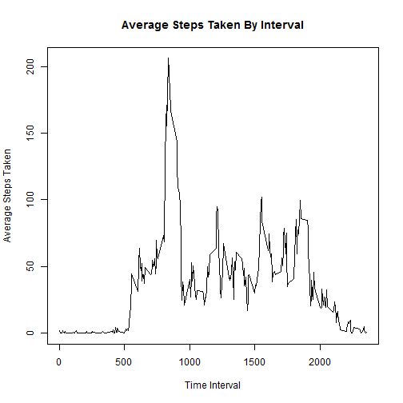

This report will analyze activty tracking data in a variety of ways.

To begin, we should load necessary packages and our dataset:


```r
library(dplyr)
library(lattice)
setwd("C:\\Users\\mdavie\\Desktop\\RepData_PeerAssessment1")
raw.data <- read.csv(".\\activity\\activity.csv")
```

Let's show a histogram of the number of steps taken each day. To do this we will first need to summarize the step counts by day, then create a histogram of this summarized data.


```r
daily.steps <- raw.data %>%
     group_by(date) %>%
     summarise(sumSteps = sum(steps))
hist(daily.steps$sumSteps,
     main = "Histogram of Daily Step Counts",
     xlab = "Number of Steps",
     ylab = "Frequency")
```


We might also like to know the mean and median number of steps taken. Since there are NAs in our data set we need to specify that they be ignored.


```r
print(mean(daily.steps$sumSteps, na.rm = TRUE))
```

```
## [1] 10766.19
```

```r
print(median(daily.steps$sumSteps, na.rm = TRUE))
```

```
## [1] 10765
```

We might be interested to see when in the day (5 minute intervals) the most steps are taken. Let's create a plot to see this.


```r
interval.steps <- raw.data %>%
      group_by(interval) %>%
      summarise(avgSteps = mean(steps, na.rm = TRUE))
plot(interval.steps$interval,
     interval.steps$avgSteps,
     type = 'l',
     main = "Average Steps Taken By Interval",
     xlab = "Time Interval",
     ylab = "Average Steps Taken")
```




Having looked at the data, it is clear that the dataset includes many NA values.  Let's see how many there are total.


```r
print(sapply(raw.data,function(x) sum(is.na(x))))
```

```
##    steps     date interval 
##     2304        0        0
```

As we can see, there are 2304 missing step counts. To impute those values, we can use the average value for the interval and create a new dataset.


```r
raw.data2 <- raw.data
raw.data3 <- raw.data2[is.na(raw.data2$steps),]
raw.data3 <- merge(raw.data3, interval.steps, by = 'interval', all.x = TRUE)
raw.data3$steps <- raw.data3$avgSteps
raw.data3 <- raw.data3[,1:3]
raw.data2 <- raw.data2[!is.na(raw.data2$steps),]
raw.data.new <- rbind(raw.data2, raw.data3)
```

Now there are no NA values:


```r
print(sapply(raw.data.new,function(x) sum(is.na(x))))
```

```
##    steps     date interval 
##        0        0        0
```

Let's see how our previous histogram, mean, and median look now.


```r
daily.steps.new <- raw.data.new %>%
     group_by(date) %>%
     summarise(sumSteps = sum(steps))
hist(daily.steps.new$sumSteps,
     main = "Histogram of Daily Step Counts",
     xlab = "Number of Steps",
     ylab = "Frequency")
```


```r
print(mean(daily.steps.new$sumSteps))
```

```
## [1] 10766.19
```

```r
print(median(daily.steps.new$sumSteps))
```

```
## [1] 10766.19
```

Our mean has not changed, but our median has increased and now equals our mean.

Let's say we wanted to see the difference in activity level between weekdays and weekends.  We could do this by first transforming our date variable into a POSIXlt date and using the weekdays function to determine which day of the week each date in our dataset is. We could then plot weekends against weekdays.


```r
raw.data.new$date <- as.POSIXlt(raw.data.new$date)
raw.data.new$day.type = ifelse((weekdays(raw.data.new$date) == "Saturday"                                 | weekdays(raw.data.new$date) == "Sunday"),
                               "Weekend",
                               "Weekday")
day.interval.steps <- raw.data.new[,c(1,3,4)] %>%
      group_by(day.type, interval) %>%
      summarise(avgSteps = mean(steps, na.rm = TRUE))
xyplot(avgSteps~interval | day.type, data = day.interval.steps, type = "l", xlab = "Interval",ylab = "Number of Steps", layout = (c(1,2)))
```


Interesting stuff.
